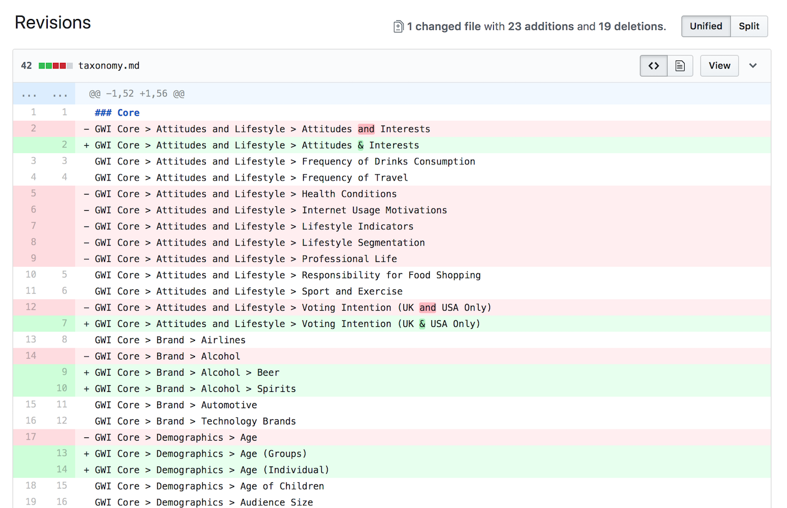

# Challenge: Labels JS

Hello! Wellcome to Labels JavaScript Challenge.

This repository contains requirements definition of project used for job applications
on **position of [Elm](https://elm-lang.org/) developer**.
Whole assignment is based on real requirement for our production app.
However since there is a lot of domain specific knowledge required for most parts of our system
and we are aware of the fact that most of this logic might be confusing for newcomers we've tried to
pick task which doesn't require any specific insight and removed all parts which might be possibly confusing to pick up.
Thanks to this this project can be used as general challenge to build HTML app in Elm.

## Position Description

Praised and used by the world largest organizations and agencies, GlobalWebIndex platform enables our clients to cut through our data using custom audiences, segmentations and modular charting library.

In its essence, GlobalWebIndex is a data company. Goal of a project you'll be developing in Labels team is to simplify work of our internal people who prepare data for [our platform](https://www.globalwebindex.com/platform) so that our customers can get data insights they need.

You will sit within our Labels team and will be jointly responsible to push the development of the product forward.
Day-to-day this involves new feature engineering, reviewing and discussing code of your colleagues and discussing the design decisions with the wider technical team.

- Ideate, brainstorm and implement new components and features using JavaScript, Elm or Ruby, if you fancy getting your hands on backend code.
- Develop the project codebase, with the focus on long-term maintenance - we look for people who really care about the quality as a day-to-day routine.
- Think forward and propose innovative approaches, which can push the project to the next level. We like to discuss things so you’ll be expected to demonstrate conclusive arguments and get a buy in from the whole team.
- Evaluate external solutions (databases, frameworks, libraries) which might be beneficial to our product.

## Basic Instructions

You are required to provide an implementation of component for browsing differences between specified files that holds text representing hierarchical structure.
These files contains multiple `projects`. Each `project` might have or have not multiple `categories` which composed together represents `path` to our data. This is something we call `taxonomy`.
User can compare specified revisions between each other.
All data are provided in `text` format in [data directory](data/).

**For inspiration, this is how compare function could look like in our production system:**

## Introduction

There are 3 revisions of taxonomies. You'll find all necessary data inside [/data](data) folder.
Data are in plain `text` format which represents human readable form of taxonomies.
Your job is to **visualize differences between 2 revisions specified by user** and **build diff browser** as a single-page application. You can use one of the screenshots in [/media](media) folder as an inspiration for UI or come with any own layout.
There are basically 3 **diff types**: unified, split and fluid view. Choose one type for your implementation.
Your solution should be fast enough even when comparing larger files (1k lines).

**Optional task**: You can implement additional diff type and improve your diff browser solution with `view` selector that allows user to switch between different diff types.

## General Acceptance Criteria

- Implementation must be done in `Elm`.
- You can use any 3rd library & framework you want to.
- No dynamic server render is allowed. All functionality must be done on client.
- All naming including comments and additional documentation must be in English language.
- Final result must be in form of full git repository with your own implementation.
- Your solution should be dockerized application with informations how to run it.
- There are **no time restrictions** for completing this challenge.
- **In case you want to apply for the job but have no time finishing anytime soon let us know you're interested anyway.** (We are people too)

## Where to Start

If you are interested in applying for this position or just want to challenge yourself (which is also 100% OK for us)
please continue in following steps:

- Create new private repository under your GitHub or Bitbucket account and import there code from this repository (so that you don't share your solution with other candidates).
- Complete implementation inside your repo and invite us for review (GH / Gitlab user names: `romansklenar`).
- Open pull request in your repository with your own implementation.
- Comment your pull request with a message letting us know that we can review your code.
- Comment your PR with any question in case you will need any help (or send us email - see bellow).
- **You can also open pull request before you're finished with implementation in case you are willing to discuss anything!**

## Goal

The goal is to test your ability to come up with solution for real world problem which will be part of your day to day responsibility.
Obviously the first thing what we will look at is to what degree your implementation satisfy original requirements.
Also we want to see your ability to come up with robust & efficient solution and will look on over all code quality.

## Contacts

In case you want to apply for position in our team please contact `thunt@globalwebindex.net`.
If you have any questions about implementation itself you can send me mail to `roman@globalwebindex.net`
or open issue/PR in this repository so we can discuss any part together.

## License

MIT
